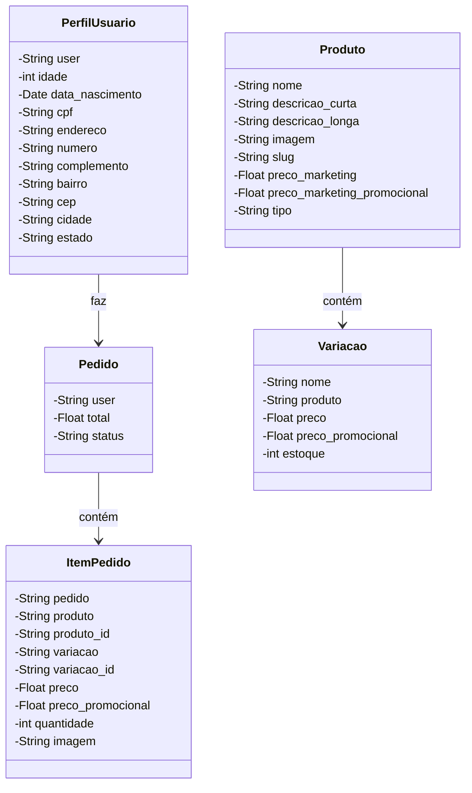

# 🛒 Loja de Vendas - Sistema de E-commerce 

Este projeto é um sistema de e-commerce desenvolvido em **Python** utilizando o **Django Framework** no backend e **Bootstrap** no frontend para estilização. Ele permite que os usuários façam pedidos, visualizem produtos e gerenciem seus perfis de maneira eficiente.

## Funcionalidades Principais 🚀

- **Gerenciamento de Produtos**: Cadastro de produtos e variações com preços promocionais.
- **Gerenciamento de Pedidos**: Criação e controle de status dos pedidos.
- **Perfil de Usuário**: Usuários podem criar e atualizar seus perfis com informações detalhadas.
- **Frontend Responsivo**: O site é responsivo e utiliza Bootstrap para proporcionar uma ótima experiência em dispositivos móveis.

---

## Estrutura do Projeto 🗂️

O projeto está dividido em três apps principais:

1. **pedido**: Responsável pelo gerenciamento de pedidos dos clientes.
2. **produto**: Gerencia os produtos e suas variações.
3. **perfil**: Garante o gerenciamento das informações de perfil dos usuários.

### Apps e Modelos 🏗️



## Como Rodar o Projeto Localmente 🖥️

### Pré-requisitos

- **Python 3.8+**
- **Django 4.x**
- **Bootstrap 5**

### Passo a Passo:

1. Clone o repositório:
```bash
git clone https://github.com/seuprojeto.git
cd seuprojeto
```

2. Crie e ative um ambiente virtual:

```bash
python -m venv venv
source venv/bin/activate  # Para Linux/Mac
venv\Scripts\activate  # Para Windows
```

3. Instale as dependências:

```bash
pip install -r requirements.txt
```

4. Execute as migrações do banco de dados:
   
```bash
python manage.py migrate
```

5. Inicie o servidor:

```bash
python manage.py runserver
Acesse o sistema no seu navegador em http://127.0.0.1:8000/.
```
